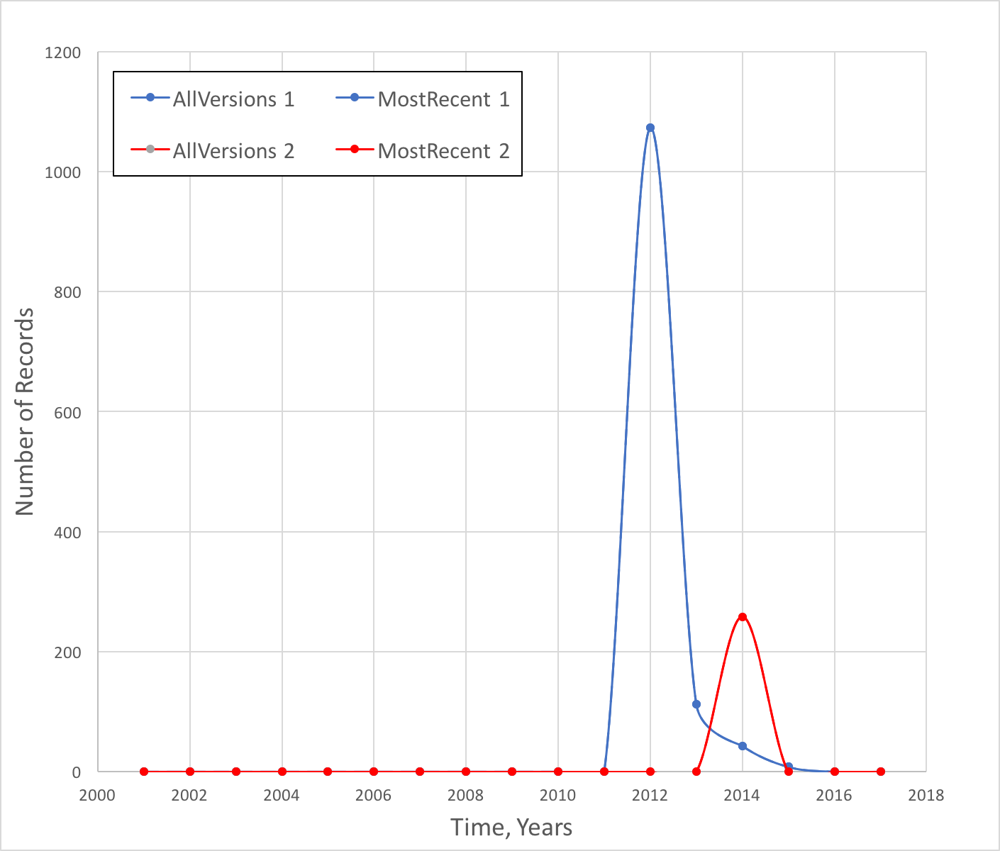
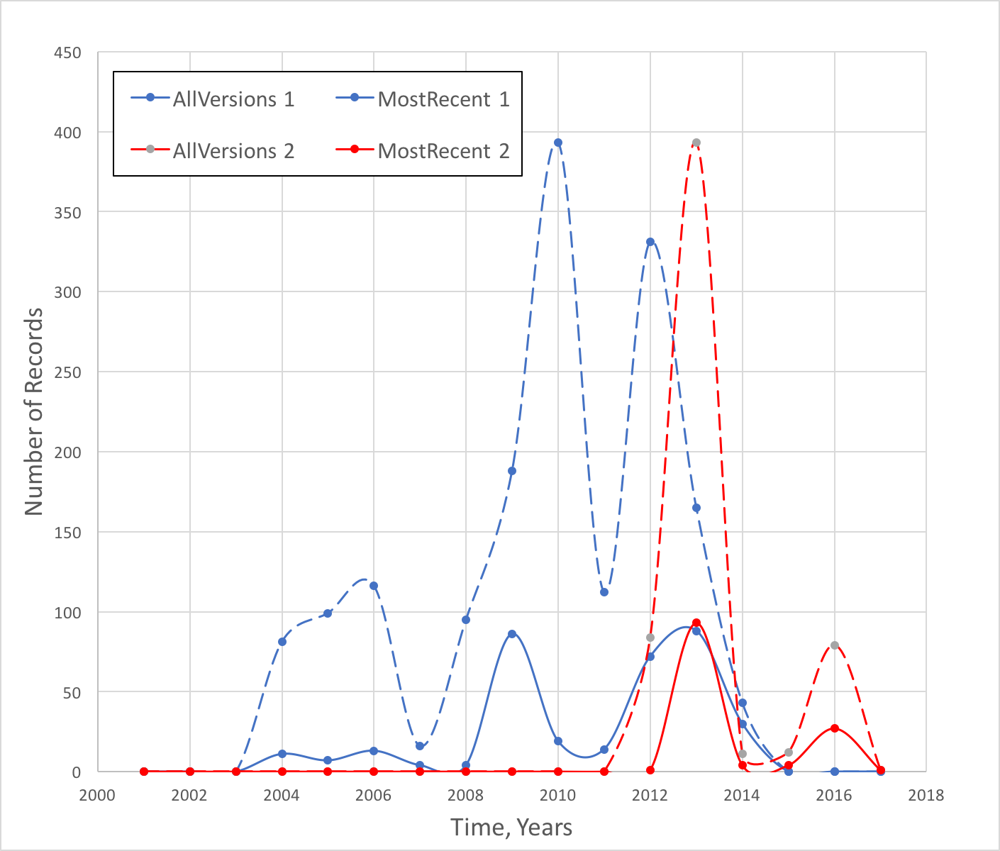

# DataOne Reporting History #
We are interested in understanding the history of reporting in the DataOne Repository. 

## Solr Queries ##
### Most recent versions ###

This solr query retrieves the counts / year of metadata records from the CN node. The -obsoletedBy retrieves records that have not been obsoleted. These are the most recent versions of the records:

https://cn.dataone.org/cn/v2/query/solr/?q=*:*+-obsoletedBy:*+formatType:METADATA  
&fq=datasource:"urn:node:CN"&rows=1&  
sort=dateUploaded+asc&  
facet=true&  
facet.missing=true&  
facet.limit=-1&  
facet.range=dateUploaded&  
facet.range.start=2001-01-01T00:00:00Z&  
facet.range.end=2017-12-31T23:59:59.999Z&  
facet.range.gap=%2B1YEAR&wt=xml  

This query was implemented for each node in the ListOfNodes tab of the NodeCounts spreadsheet. The  facet.* elements of the query set up a set of counts/year of these metadata records. These are included in the response like (LTER):

```
<int name="2001-01-01T00:00:00Z">0</int>
<int name="2002-01-01T00:00:00Z">0</int>
<int name="2003-01-01T00:00:00Z">0</int>
<int name="2004-01-01T00:00:00Z">0</int>
<int name="2005-01-01T00:00:00Z">1837</int>
<int name="2006-01-01T00:00:00Z">571</int>
<int name="2007-01-01T00:00:00Z">308</int>
<int name="2008-01-01T00:00:00Z">186</int>
<int name="2009-01-01T00:00:00Z">325</int>
<int name="2010-01-01T00:00:00Z">586</int>
<int name="2011-01-01T00:00:00Z">746</int>
<int name="2012-01-01T00:00:00Z">451</int>
<int name="2013-01-01T00:00:00Z">767</int>
<int name="2014-01-01T00:00:00Z">291</int>
<int name="2015-01-01T00:00:00Z">45020</int>
<int name="2016-01-01T00:00:00Z">2875</int>
<int name="2017-01-01T00:00:00Z">1349</int>
```

### All Versions ###
The -obsoletedBy was removed from the query in order to retrieve all uploaded metadata records.

### Extracting Counts ###
Use extractXpath.xsl with the path /response/lst/lst/lst/lst/int to createextractXpath.txt, import that into excel and add years. The NodeCounts tab in the NodeCounts.xlsx spreadsheet has the counts data. These data are summarized in the pivotTable on the Summary tab. The type field is used to differentiate between the AllVersions and MostRecent counts.
## AllVersions vs. MostRecent ##
The most straightforward comparison of these two counts is the ratio AllVersions/MostRecent which is termed the *revision ratio* and gives an indication of the number of versions that have been created for each metadata record. This ratio varies between 1 and 4.7 (see Table).

Revision Ratio Range  | Number of Nodes | Revision Ratio Range  | Number of Nodes
------------- | ------------- | ------------- | -------------
1 | 16 | 2 - 2.99  | 6
1.0001 - 1.09  | 8 | 3 - 3.99  | 3
1.1 - 1.99 | 4 | 4 - 4.99   | 2
 

A second number that provides some insight into node behavior is the number of years during which a node submits records (*yearCounts*). Our observations include seventeen years, so this number varies between 1 and 17. 

Nodes that have only one version of their records (revision ratio = 1) are the largest observed group with sixteen members. The largest group of these nodes (7/16) have submitted all of there records during one year. The largest collection of original records (31,000+) were submitted over 4 years by CDL.

 

This Figure shows yearly submission counts for ORNLDAAC (blue) and US\_MPC (red). ORNLDAAC submitted 1237 records over four years (2012-2015) while US\_MPC submitted 258 records during one year (2014). Note that the AllVersions and MostRecent data overlap for both of these nodes indicating no revisions (revision ratio = 1).

Member nodes with large revision ratios show histories with large numbers of submitted records that are eventually obsoleted by new versions. Two of the most active are shown in the Figure below. SANPARKS has the largest observed revision ratio (4.7) and a long and active history of submitting many records (blue dashed line, 1639 total) that are eventually revised down to a much smaller number (348) of final records (blue solid line). GOA submitted most of their records during 2012 and 2013 (red dashed line) and revised many of these (red solid line). A similar pattern is observed during 2016.

 


 
