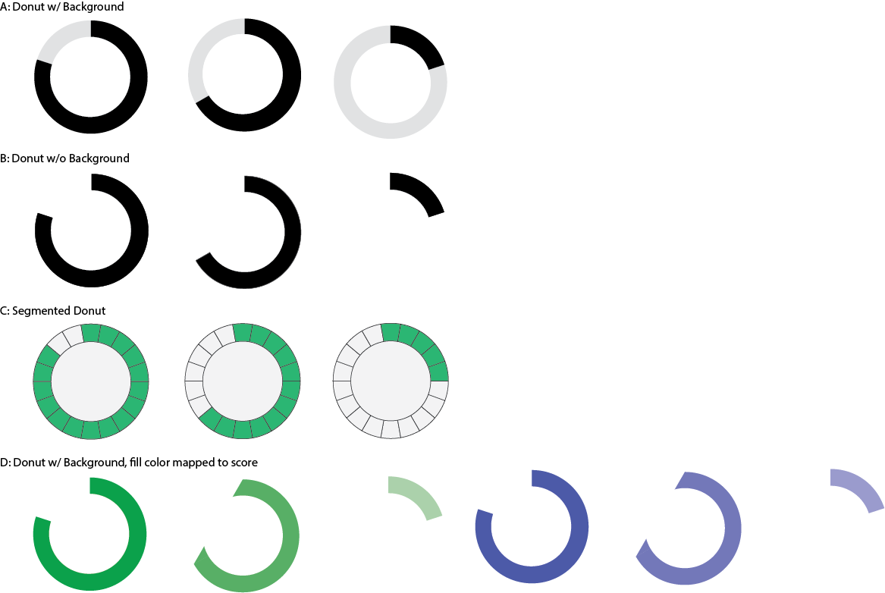

# Package View Mockups

## Location ideas

Where do these badges go in this view?
- Right below the citation
- Part of the citation
- To the right or left side
- To the right of the 'Copy Citation' button

## Shape Ideas

- Donut
- Waffle chart (TODO)
- Badges.io style badges
- re3data badges
- Open Science Framework Badges

## Donut Shape Ideas

# Package view

